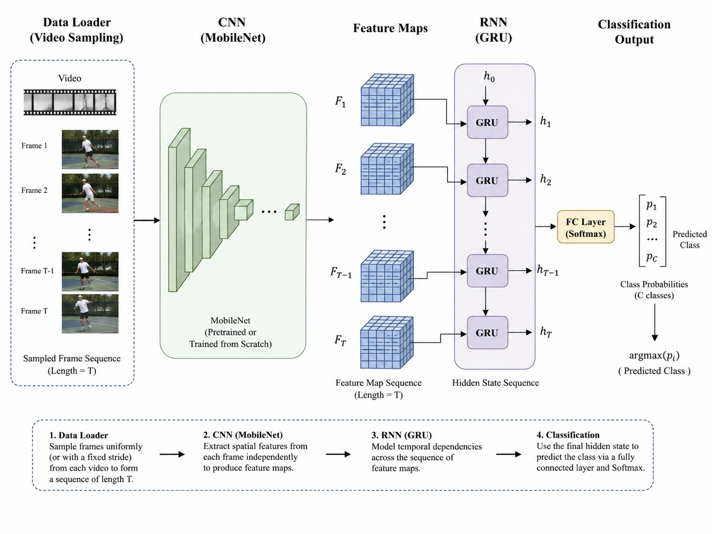

---
output:
  html_document: default
  pdf_document: default
---
# HMDB51 – Complete project explanation (from scratch)

> Goal of this document: understand **what** the project does, **why** it is structured this way,
> and **how** every piece of code works, truly starting from zero, taking nothing for granted.

---

## 1. The problem: what do we want to do?

We want to build a program that, given a **video** of a person performing an action,
guesses **which action it is** among 51 possibilities (e.g. *run*, *wave*, *sit*, *drink*…).

This is called **video classification** (or *action recognition*).

- **Input:** an `.avi` video file (e.g. a person brushing their hair).
- **Output:** one of the 51 classes (e.g. `brush_hair`).

The dataset is called **HMDB51**:
- **51 action classes**;
- ~**6,700** short videos (a few seconds each);
- about a hundred videos per class.

### Why is a video harder than a photo?

A photo is 1 image. A video is a **sequence of images** (frames) over time.
The difference between "standing up" and "sitting down" is not in a single frame (which can be identical),
but in the **temporal order** of the frames. So our model must look at **both space**
(what is in each frame) **and time** (how the frames change).

---

## 2. The general idea of the solution

The main model works in **two steps**: a CNN that *sees* each frame, and an RNN that *reads* the
sequence of frames over time.

<p align="center">
   MobileNetV2 per frame -> bidirectional GRU over the feature sequence -> softmax classifier" width="100%">
</p>

1. **MobileNetV2** looks at each single frame and turns it into numbers ("what is in the image").
2. **Bidirectional GRU** reads the 16 vectors in sequence and understands **the motion** ("how it changes over time").
3. A final **Dense** layer (softmax) picks the class.

There is also a simpler alternative model, `conv3d`, discussed later.

---

## 3. Deep-learning basics (the bare minimum)

- **Neural network**: a function with millions of adjustable numbers (the **weights**) that learns from examples.
- **Training**: we show the network many videos together with the right answer;
  it makes mistakes, measures the error (**loss**) and adjusts the weights to make fewer mistakes. This repeats for many **epochs**
  (one epoch = one full pass over all the training data).
- **Loss**: a number that says "how wrong you were". Lower is better. We want it to **go down**.
- **Accuracy**: the percentage of correct answers. We want it to **go up**.
- **Train / Validation / Test**: we split the data into three groups
  - **train**: the network learns on these;
  - **validation (val)**: the network does NOT learn on these; we use them to check whether it is generalizing;
  - **test**: the final judgment, used only once at the very end.
- **Overfitting**: when the network "memorizes" the train set (high train accuracy) but does poorly on new data
  (low val/test). It is enemy number one.
- **Transfer learning**: instead of starting from scratch, we reuse a network already trained on millions of images
  (MobileNetV2 on ImageNet). It saves time and data. It is the heart of the project.

---

## 4. Project structure (the files)

```
HMDB project/
├── dataset/                     # everything about the data, in one place
│   ├── hmdb51/                  # the .avi videos, one folder per class
│   ├── testTrainMulti_7030_splits/  # official files saying which videos are train/test
│   └── manifests/              # generated CSVs: video lists for train/val/test
├── outputs/                     # training results (models, plots, metrics)
├── scripts/                     # all Python code (flat, easy to import)
│   ├── prepare_dataset.py       # 1) builds the train/val/test lists
│   ├── video_io.py              # 2) reads a video and turns it into numbers
│   ├── data.py                  # 3) creates the "pipeline" of data for TensorFlow
│   ├── models.py                # 4) defines the models (conv3d, mobilenet_gru)
│   ├── metrics.py               # 5) evaluates the model and makes the plots
│   ├── prepare_hmdb51_dataset.py   # standalone dataset preparer (CLI)
│   └── train_twophase.py            # standalone two-phase training script
├── notebooks/
│   └── HMDB51_TensorFlow_Classifier.ipynb   # the notebook that uses everything else
├── assets/architecture.png      # diagram used in this document
├── README.md
└── SPIEGAZIONE_PROGETTO.md
```

The idea of putting all the code in `scripts/` (instead of one giant notebook) is the **separation of concerns**:
each file does **one thing** and does it well. This makes the code reusable, testable and readable.
The notebook becomes only the "conductor" that calls these functions in the right order.

---

## 5. The complete flow, step by step

```
[1] prepare_dataset.py  →  reads the official splits  →  writes 3 CSVs: train / val / test
[2] video_io.py         →  for each video: extracts 16 frames, resizes them, normalizes them
[3] data.py             →  packs everything into a tf.data.Dataset (batch, shuffle, augment)
[4] models.py           →  builds the network (MobileNetV2 + GRU  or  conv3d)
[5] training (notebook) →  model.fit(...)  →  the network learns, saves the best model
[6] metrics.py          →  loads the best model  →  accuracy, F1, confusion matrix
```

Now let's explain each file **and why it is written this way**.

---

## 6. `prepare_dataset.py` — preparing the lists (manifests)

### The problem
HMDB51 ships with official `.txt` files (e.g. `brush_hair_test_split1.txt`) that, line by line,
say for each video: `1` = train, `2` = test, `0` = unused. We have to:
1. read these files;
2. associate each video with its **numeric label** (class 0..50);
3. derive a **validation** set (which the official splits do not provide);
4. save everything into convenient CSVs.

### The functions and the why

**`_read_classes(data_root)`**
Reads the names of the 51 classes simply by looking at the folder names inside `dataset/hmdb51/`,
sorted alphabetically. Alphabetical order matters: it guarantees that class `brush_hair`
is **always** number 0, `cartwheel` is 1, etc., in a **reproducible** way.

**`class_to_index = {c: i for i, c in enumerate(classes)}`**
Creates the name→number dictionary (e.g. `'ride_bike' → 30`). The network does not understand words,
only numbers: every class becomes an integer.

**`_parse_split_file(...)`**
Reads a split file and produces one record per video with: path, label, class name,
whether it is train/test/unused, and `exists` (does the file really exist on disk?). That `exists`
check matters because some videos referenced in the splits may be missing (indeed the summary reports
`missing_files: 78`): better to discover this up front than to crash during training.

**`_stratified_val_split(train_records, val_ratio, seed)`**  ← important idea
The official splits only give train and test. To monitor overfitting we also need a
**validation set**, which we carve out of the train set. We do it in a **stratified** way:
we take 15% **from each class separately**, not at random from the whole pile.
- *Why?* If we picked at random, by bad luck val could end up with no videos at all from a
  given class. By stratifying, every class is represented proportionally in both train and val.
- The `seed` (fixed number, 42) makes the "random shuffle" **always the same**: re-running gives
  the same split → reproducible experiments.

**`build_manifests(...)`** (the public function)
Puts everything together: reads the classes, parses the splits, separates train/test/unused, derives the
stratified val, and **writes the CSVs** (`split1_train.csv`, `split1_val.csv`, `split1_test.csv`) plus a
`classes.txt` and a JSON summary of the counts.

> **Why generate CSVs instead of working directly on the videos?**
> Because a CSV is light and fast: it contains only the **paths** and the **labels**. The heavy videos
> are read only afterwards, and only when needed.

---

## 7. `video_io.py` — from video to numbers

A single function, `decode_video(path, frame_count=16, image_size=160)`, turns an `.avi` file
into an array of numbers ready for the network. Logic:

1. **Opens the video** with OpenCV (`cv2.VideoCapture`). If it does not open, it returns a block of **zeros**
   (so the pipeline does not crash on a broken file — a "soft" failure).
2. **Reads all frames** one by one. For each one:
   - converts from BGR to **RGB** (OpenCV uses BGR, but networks expect RGB);
   - **resizes** to `image_size × image_size` (here 160×160), so all frames have the same shape;
   - **normalizes** by dividing by 255 → pixels go from `0..255` to `0..1`.
3. **Samples 16 frames** uniformly along the whole video with `np.linspace`.
   - *Why 16 and not all of them?* Videos have different lengths and hundreds of frames. By taking
     **always 16 evenly spread** from start to end we get a temporal summary of fixed size,
     independent of the video's duration.
4. Returns an array of shape `(16, image_size, image_size, 3)` in `float32`.

> **Why normalize to `[0,1]`?** Networks learn much better when the input numbers are small and
> in a standard range. Large numbers (0..255) would make training unstable.

---

## 8. `data.py` — the data pipeline for TensorFlow

Here we build the flow that feeds the network during training. TensorFlow wants a
`tf.data.Dataset` object: a kind of "conveyor belt" that produces batches of data efficiently.

**`read_class_names` / `read_manifest`**
Read `classes.txt` and the CSVs created earlier. `read_manifest` has a
`limit_per_class` option: useful for **quick tests** by taking only N videos per class.

**`_augment_video(video, label)` — data augmentation** ← important idea
During training we apply small random changes to each video:
- sometimes we **flip it horizontally**;
- slightly change **brightness** and **contrast**;
- then re-clamp the values into `[0,1]`.
- *Why?* To **artificially increase the variety** of the data. An action stays the same if the image
  is a bit brighter or mirrored, but to the network these are "new" examples. This **reduces overfitting**.
- It is applied **only to training**, never to validation/test (there we want to measure on "clean" data).

**`make_dataset(...)`** (the central function)
Builds the complete dataset: reads the records from the CSV, creates the dataset from the
`(path, label)` pairs, **shuffles** (only for training), `.map(decode_video)` (wrapped in
`tf.numpy_function`, because OpenCV is plain Python), applies augmentation (training only),
`.batch(8)` and `.prefetch(...)` so the next batch is ready while the GPU works on the current one.

> **Key idea:** the pipeline produces frames in `[0,1]`. Keep this in mind: the MobileNet
> model does one extra step to bring them into `[-1,1]` (see below). The two pieces must "talk" to each other.

---

## 9. `models.py` — the models

### Model A — `mobilenet_gru` (the main one)

```python
inputs = Input(shape=(frame_count, image_size, image_size, 3))
x = Rescaling(scale=2.0, offset=-1.0)(inputs)          # [0,1] -> [-1,1]
backbone = MobileNetV2(..., weights='imagenet', include_top=False, pooling='avg')
x = TimeDistributed(backbone)(x)                        # applies MobileNet to EVERY frame
x = LayerNormalization()(x)
x = Bidirectional(GRU(128, dropout=...))(x)             # reads the temporal sequence
x = Dropout(...)(x); x = Dense(256, relu)(x); x = Dropout(...)(x)
outputs = Dense(num_classes, softmax)(x)                # 51 probabilities
```

Piece by piece, **with the why**:

- **`Rescaling(2.0, -1.0)`**: the frames arrive in `[0,1]`; MobileNetV2 was trained on images in
  `[-1,1]`. This line does the conversion (`x*2 - 1`). Without it, we would feed MobileNet "wrong" inputs.
- **`MobileNetV2(weights='imagenet', include_top=False, pooling='avg')`**: downloads the weights
  **already trained** on 1.28M images (transfer learning); removes the original 1000-class head;
  compresses the output into **one vector of 1280 numbers** per frame.
- **`TimeDistributed(backbone)`**: applies the **same** MobileNet to all 16 frames, independently.
  Result: 16 vectors of 1280. This is "looking at space, frame by frame".
- **`Bidirectional(GRU(128))`**: the temporal part. The GRU reads the 16 vectors in sequence keeping a
  "memory"; *bidirectional* means it reads them **both forward and backward** (→ output of 256).
  This is "looking at time, forward and backward".
- **`Dropout`** + **`Dense(51, softmax)`**: dropout reduces overfitting; the final softmax produces
  51 numbers that sum to 1, i.e. the **probability** of each class.

#### The `try/except` on the weights and the **two phases** (crucial part)
If the download of the ImageNet weights fails, the code **stops with a clear error** instead of
silently continuing with random weights — which would pin accuracy at chance (~1/51) and look like
a "broken model" when in fact only the download failed.

The **`backbone_trainable`** parameter controls the transfer-learning strategy:
- `False` → **FROZEN backbone** (Phase A): only the new head (GRU+Dense) is trained. Fast, safe.
- `True` → **UNFROZEN backbone** (Phase B): MobileNetV2 is fine-tuned too. Powerful but risky.

> **Golden rule learned in the project:** first train the head with the backbone **frozen** (Phase A),
> then fine-tune by unfreezing the top blocks with a very low learning rate (Phase B). Unfreezing right away,
> with the head still random, **destroys** the ImageNet weights and pins accuracy near chance (~0.02).
> Here the two-phase approach **helps**: test accuracy rises from **40.4% to 43.5%** (see §12 and §14).

### Model B — `conv3d` (from-scratch alternative)
A small **3D** CNN that looks at **space and time together** with `Conv3D` convolutions. It does not use
ImageNet: it trains **from scratch**. Simpler and download-free, but on a small dataset like HMDB51 it is
inevitably weaker than transfer learning.

---

## 10. `metrics.py` — evaluation and plots

**`evaluate_to_dir(model, dataset, class_names, output_dir)`**
Measures how good the model is on the test set and saves everything: predictions vs true labels, the
**confusion matrix**, per-class **precision/recall/F1**, the **macro** metrics and the global **accuracy**.
Outputs go to `metrics.json`, `classification_report.csv`, and `.png` plots.

> **Why macro metrics and not just accuracy?** With 51 classes, accuracy alone can be misleading.
> Per-class metrics and the confusion matrix tell *where* the model fails (e.g. it confuses
> "run" with "walk"), which is much more informative.

**`plot_training_history(...)`**
Draws the **loss** and **accuracy** curves with train and validation together: it lets you see at a glance
whether the model is learning and whether it is overfitting (train rising while val stalls).

---

## 11. The notebook, step by step

The notebook `HMDB51_TensorFlow_Classifier.ipynb` is the "conductor": it does not contain the heavy
logic (that lives in `scripts/`), it just calls it in the right order: imports + SSL fix → parameters →
dataset check → build manifests → load lists → frame preview → build datasets → build model → **Phase A
training** → **Phase B fine-tuning** → training curves → test evaluation → single-video prediction.

### The two-phase training, visualized
The plot below shows the full run: **Phase A** (frozen backbone) on the left, then **Phase B**
(fine-tuning from `block_11`) after the dashed line. Train accuracy keeps rising toward ~0.70, while
validation settles around ~0.42 — the gap is the normal generalization gap, not a bug.

<p align="center">
  
</p>

### Important training details
- **`Adam` optimizer** + **`sparse_categorical_crossentropy`** with **label smoothing 0.1** (discourages
  over-confidence and improves generalization).
- **Callbacks**: `ModelCheckpoint` (saves the best `val_accuracy`), `EarlyStopping` (stops and restores the
  best weights), `ReduceLROnPlateau` (lowers the LR when val stalls), `CSVLogger` (writes `history.csv`).

---

## 12. Key lessons learned (summary to remember)

1. **Train vs Validation vs Test:** watch the *val accuracy* to **guide** training, but the **final**
   result to report is the **test**. Here: train ≈ 0.70, val ≈ 0.42, **test 0.4348** → the honest number is **0.43**.
2. **Transfer learning > from scratch** (when you have little data): `mobilenet_gru` clearly beats
   `conv3d` trained from scratch.
3. **Two phases in transfer learning:** Phase A (frozen backbone, LR 1e-3) gives most of the gain;
   Phase B (unfrozen from `block_11`, LR 3e-5) adds a few extra points (40.4% → 43.5%).
4. **Order matters:** unfreezing too early destroys the ImageNet weights. Train the head first, then fine-tune.
5. **0.02 accuracy = chance level** (1/51). If you see it *stuck* for several epochs → something is broken.
6. **Reproducibility:** `seed=42` everywhere makes the experiments always give the same result.
7. **Separation of concerns:** each file does one thing; the notebook orchestrates them.

---

## 13. Recommended configuration (the final model)

```python
MODEL_NAME = 'mobilenet_gru'
WEIGHTS = 'imagenet'
FRAMES = 16
IMAGE_SIZE = 160
BATCH_SIZE = 8
DROPOUT = 0.5
LABEL_SMOOTHING = 0.1
# Phase A - frozen backbone
EPOCHS_HEAD = 20
LR_HEAD = 1e-3
# Phase B - fine-tuning
DO_FINETUNE = True
EPOCHS_FINETUNE = 15
LR_FINETUNE = 3e-5
FINETUNE_FROM_BLOCK = 'block_11'
```
→ Result: **test accuracy ≈ 43.5%** (macro-F1 ≈ 42%) on the 1,511-video official test split.
Running Phase A only (no fine-tuning) gives **≈ 40.4%**; the second phase adds ~3 points.

---

## 14. Error analysis: the confusion matrix

After training `mobilenet_gru` with the two-phase strategy, we evaluated on the **official test set**
(1,511 videos). With 51 classes, pure chance is 0.0196, so **0.4348 is ~22× better than chance** —
an honest baseline, not an exceptional one (macro-F1 0.42, macro-precision 0.44, macro-recall 0.44).

### Which classes work, and which don't
Some classes are excellent (recall ≈ 0.9), others fail completely (recall 0.0). The plot below sorts the
classes by accuracy: the easy ones at the top, the hard ones at the bottom.

<p align="center">
  
</p>

**Well-recognized classes 👍** — `pullup` (0.93), `golf` (0.90), `shoot_bow` (0.90), `situp` (0.90),
`pour` (0.87), `ride_bike` (0.83), `kiss` (0.80). **Common thread:** they have a **distinctive object or
scene** always present (bar, golf club, bow, container, bicycle). MobileNetV2 is trained on ImageNet, so it
is excellent at recognizing **objects and scenes**: when an action is "anchored" to an object, a single
frame is enough.

**Almost-always-wrong classes 👎** — `wave` (0.00), `clap` (0.03), `hit` (0.03), `punch` (0.03),
`pick` (0.10), `throw` (0.10), `stand` (0.10). **Common thread:** they are defined by a **fast or subtle
motion**, not by an object. In a single frame they are ambiguous.

### The most frequent confusions and why they are logical

<p align="center">
  
</p>

| Error (true → predicted) | Why it makes sense |
|---|---|
| `laugh → smile`, `chew → smile` | all = **face/mouth**, near-identical frames |
| `swing_baseball → throw` | same **arm-throwing motion** |
| `draw_sword → sword_exercise` | same **object** (sword) in scene |
| `cartwheel → handstand`, `flic_flac → somersault` | same **inverted body pose** |
| `shake_hands → hug`, `punch → shake_hands` | **two people close together** interacting |
| `eat → drink`, `talk → drink` | **hand moving toward the mouth** |

The model fails when two actions **look alike in a still photo** and differ only in **motion**.
The full picture is in the confusion matrix: a strong diagonal (correct predictions) with off-diagonal
mass concentrated exactly on the visually-similar pairs above.

<p align="center">
  
</p>

Three concrete causes in this setup:
1. only **16 sampled frames** → brief motions (a punch, a wave) get "lost";
2. resolution **160×160** → fine motion details blurred;
3. the backbone mostly learned **static-object** features (ImageNet), not motion.

### A note on honest evaluation: train vs validation vs test
Train accuracy reaches ≈ 0.70, validation peaks around **0.42**, and the official **test accuracy** is
**0.43**. Validation (≈ 0.42) and test (≈ 0.43) are **very close** → the evaluation protocol is honest,
with no large leakage gap; the real gap is the normal **generalization gap** between train and unseen data.

➡️ **The number to report is the test accuracy (0.43)**, on the independent official test split.
Validation only serves to guide training (early stopping / checkpoint selection).

### How it would be improved (linked to the errors)
Since the problem is **motion**:
- **Optical flow / two-stream**: a second branch that receives explicit motion — the classic technique
  that brings HMDB51 to 50–60%.
- **More frames and higher resolution** (e.g. 32 frames, 224 px).
- **Modern video models** (I3D, R(2+1)D, video transformers) that model space and time jointly.

For an educational project, 0.43 with a simple baseline **plus an analysis of why the errors happen**
is worth more than a high number without an explanation.

---

*Document written as a didactic guide to the HMDB51 project. Keep it next to the notebook: it explains not only
"what" the code does, but above all "why" it is written this way.*
