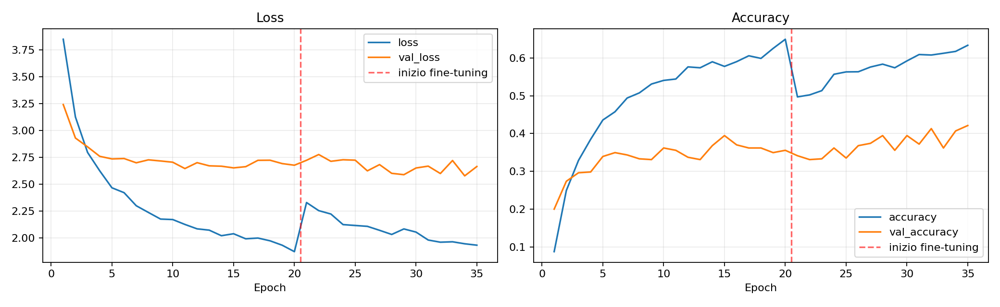
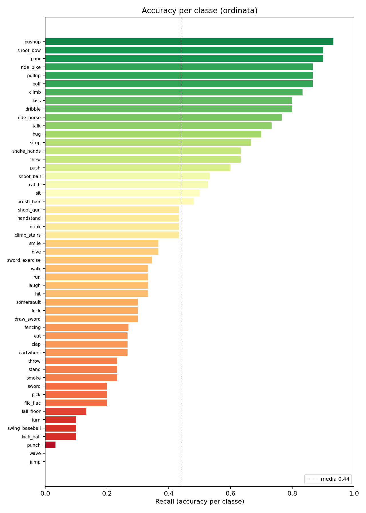
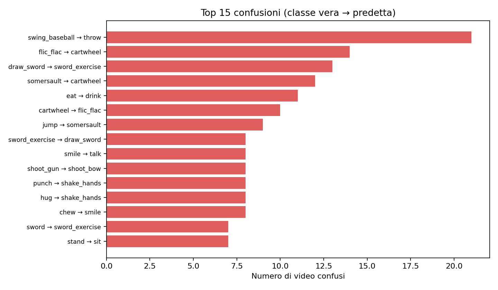
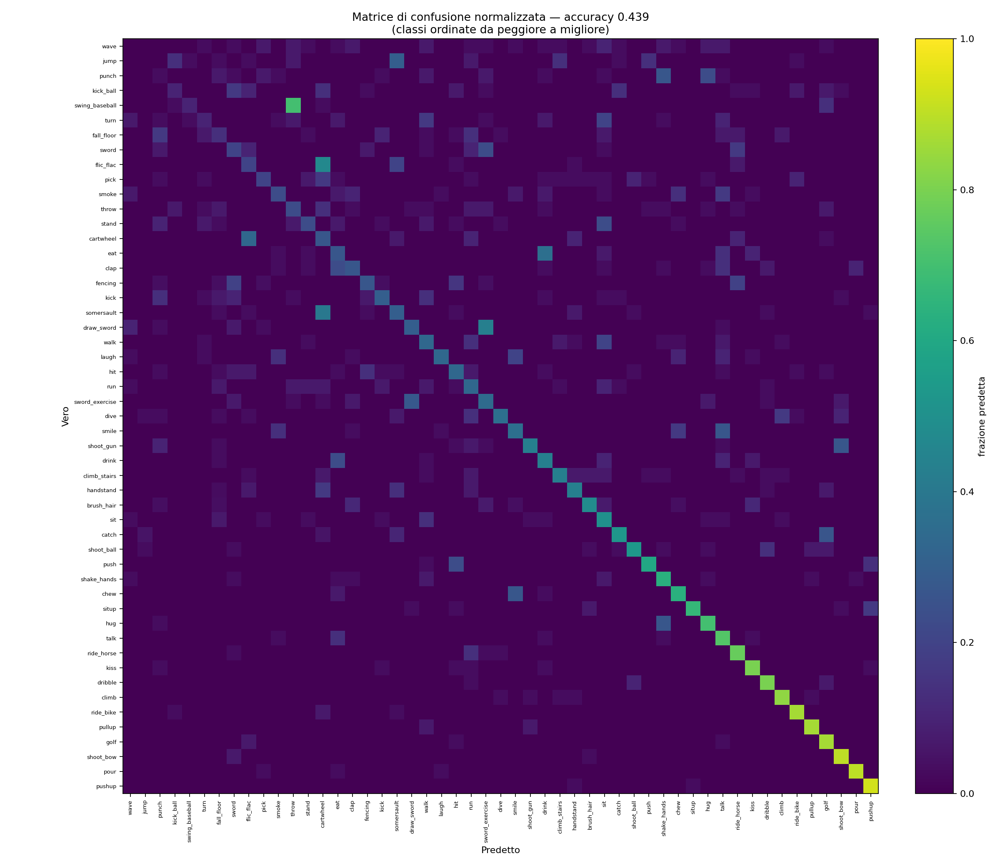

<div align="center">

# Human Action Recognition on HMDB51

<p><strong>A reproducible deep-learning study of spatio-temporal video classification: transfer learning, two-phase fine-tuning, and a detailed error analysis of why temporal actions are hard to recognize across 51 classes.</strong></p>

<p>
  
  
  
  
  
  
  
  
</p>

<p>
  <a href="https://github.com/linshenhao"></a>
  <a href="https://www.linkedin.com/in/linshenhao-49b127393"></a>
</p>

</div>

---

## Overview

Action recognition asks a model to look at a **short video** and decide **which human action** is taking place. Unlike image classification, the answer often does not live in any single frame: the difference between *sitting down* and *standing up* is the **temporal order** of the frames, not their content.

This project develops a controlled and reproducible deep-learning workflow for classifying **51 human actions** from the **HMDB51** dataset, combining:

- a frozen, ImageNet-pretrained **MobileNetV2** that encodes each frame (the spatial dimension);
- a **bidirectional GRU** that reads the sequence of frame descriptors (the temporal dimension);
- a **two-phase transfer-learning** strategy (frozen backbone, then careful fine-tuning);
- an **honest evaluation** on the official test split, with a full per-class error analysis.

The central finding is that the spatial component works well — actions anchored to a distinctive object are recognized reliably — while subtle, fast motions remain the hard cases, and the official test accuracy is the only metric worth reporting.

## Key results

Evaluated on the **official HMDB51 test split 1** (1,511 videos). Random chance across 51 classes is **1.96%**.

| Validation-selected model | Strategy | Test accuracy | Test Macro F1 | Test Macro Precision |
|---|---|---:|---:|---:|
| **MobileNetV2 + BiGRU — two-phase** | frozen head → fine-tune from `block_11` | **43.48%** | **42.16%** | **43.89%** |
| MobileNetV2 + BiGRU — Phase A only | frozen backbone | 40.44% | 39.07% | 40.14% |
| Conv3D (baseline) | trained from scratch | substantially lower | — | — |

Two observations drive the rest of this study:

- **Transfer learning is decisive.** The same pipeline trained from scratch (`conv3d`) stays far behind the ImageNet-pretrained backbone — on a relatively small dataset, reusing strong visual features matters more than architecture.
- **Fine-tuning helps, but only in the right order.** Unfreezing the backbone *after* the head has converged lifts the test accuracy from **40.4%** to **43.5%**. Unfreezing it too early destroys the pretrained weights (see [Two-phase training](#two-phase-training-strategy)).

<p align="center">
  
</p>

## Why this problem is difficult

A photo is one image; a video is a **sequence** of images over time. The model must reason about two dimensions at once:

- **space** — what each frame contains (a person, a bicycle, a wall);
- **time** — how the frames change (a body rising, a hand moving to the mouth).

HMDB51 makes this especially hard:

- **51 classes**, ~6,700 short clips, only about a hundred per class — little data per category;
- many actions are visually ambiguous in a still frame (`laugh` vs `smile`, `eat` vs `drink`);
- clips come from films and YouTube with varied scale, lighting and camera motion.

For these reasons ordinary accuracy is reported alongside **Macro F1**, **Macro precision/recall**, and a full **confusion matrix**, so that performance on rare and motion-defined classes is not hidden by the easy ones.

## Data and preprocessing

HMDB51 ships with **official splits**: text files that label each video as `1` = train, `2` = test, `0` = unused. The pipeline turns raw `.avi` clips into fixed-size tensors:

1. **Uniform frame sampling** — 16 frames are sampled evenly along the whole clip with `np.linspace`. Videos have different lengths, so a fixed, evenly spread set of frames gives a temporal summary of constant size, independent of duration.
2. **Resize and normalize** — each frame is converted BGR→RGB, resized to `160 × 160`, and scaled to `[0, 1]`.
3. **Soft failure** — if a file cannot be opened, the decoder returns a block of zeros instead of crashing the whole pipeline.

### Data protocol

| Component | Design |
|---|---|
| Train / Test | official HMDB51 split 1 |
| Validation | 15%, **stratified per class**, carved from the train pool |
| Frames per clip | 16, uniformly sampled |
| Input size | 16 × 160 × 160 × 3 |
| Augmentation | horizontal flip, brightness/contrast (train only) |
| Random seed | 42 |
| Primary metric | validation Macro F1 / accuracy (for early stopping) |
| Reported metric | **official test accuracy** |

The stratified validation set guarantees every class is represented; the fixed seed makes the split fully reproducible.

## Model architecture

The pipeline reads a video as a fixed-length sequence of frames, encodes each frame with a shared CNN (MobileNetV2), models the temporal order of the resulting feature maps with a bidirectional GRU, and predicts the action with a softmax head.

<p align="center">
  
</p>

Main model — `mobilenet_gru` ([`scripts/models.py`](scripts/models.py)):

```text
Input(shape=(16, 160, 160, 3))                # 16 RGB frames
  → Rescaling(2.0, -1.0)                       # [0,1] → [-1,1], MobileNet's expected range
  → TimeDistributed( MobileNetV2(imagenet) )   # same CNN applied to each frame → 16 × 1280
  → LayerNormalization
  → Bidirectional( GRU(128) )                  # reads the sequence forward and backward → 256
  → Dropout → Dense(256, relu) → Dropout
  → Dense(51, softmax)                          # 51 class probabilities
```

| Component | Role | Why |
|---|---|---|
| `Rescaling(2.0, -1.0)` | maps pixels from `[0,1]` to `[-1,1]` | MobileNetV2 was trained on `[-1,1]` inputs; skipping this feeds the backbone malformed data |
| `MobileNetV2(include_top=False)` | extracts 1,280 features per frame | lightweight, strong ImageNet features; the original 1,000-class head is removed |
| `TimeDistributed(...)` | applies the **same** CNN to all 16 frames | shared weights → efficient; yields one descriptor per frame |
| `Bidirectional(GRU(128))` | models temporal dynamics | reads the sequence in both directions, capturing motion better than averaging |
| `Dropout(0.5)` | randomly drops units in training | controls overfitting on a small dataset |

A `Conv3D` model trained from scratch is included as a baseline to quantify the value of transfer learning.

## Two-phase training strategy

Transfer learning here requires a precise order, learned experimentally:

| Phase | Backbone | Trainable part | Learning rate | Purpose |
|---|---|---|---:|---|
| **A** | frozen (ImageNet) | new head (GRU + Dense) | `1e-3` | learn the temporal head safely |
| **B** | last blocks unfrozen (from `block_11`) | head + top of backbone | `3e-5` | refine features toward the video domain |

> **The order is everything.** Unfreezing the backbone *while the head is still random* produces huge gradients that **destroy** the pretrained weights and pin accuracy near chance (~2%). The head must first reach a sensible state (Phase A); only then is fine-tuning safe (Phase B). Respecting this order raised test accuracy from **40.4%** to **43.5%**.

Training is supervised by `ModelCheckpoint` (keeps the best validation model), `EarlyStopping` (prevents overfitting), `ReduceLROnPlateau`, and `CSVLogger`.

## Engineering and reproducibility

Beyond setting a seed, the project includes several robustness decisions worth highlighting:

| Decision | What it does and why |
|---|---|
| **Fail loud, not silent** | If the ImageNet weights cannot be downloaded, the code raises an explicit error instead of silently continuing with random weights — which would leave accuracy at chance and look like a "broken model" rather than a missing download. |
| **SSL certificate fix** | On macOS the ImageNet download initially failed due to SSL certificates; this is handled explicitly at startup. |
| **Missing-file awareness** | 78 videos referenced by the official splits are absent on disk; the manifest builder records `exists` per file, so this is detected up front rather than mid-training. |
| **Reproducible splits** | `seed = 42` across Python, NumPy and TensorFlow; the stratified validation split is deterministic. |
| **Separation of concerns** | Each module does one job (data / video I/O / pipeline / model / metrics); the notebook only orchestrates them. |

## Error analysis

The errors are not random — they map cleanly onto the spatial/temporal split.

<p align="center">
  
</p>

**Well-recognized classes** (`climb`, `shoot_bow`, `golf`, `kiss`, `dribble`, `pullup`, `ride_bike`) all share a **distinctive object or scene** (wall, bow, club, ball, bar, bicycle). MobileNetV2 comes from ImageNet and excels at objects and scenes: when an action is anchored to an object, a single frame is enough.

**Hard classes** (`wave`, `cartwheel`, `pick`, `hit`/`punch`, `kick_ball`, `jump`) are defined by **fast or subtle motion**, not by an object. In a single frame they are ambiguous, and the model's temporal perception is its weak point.

The most frequent confusions are logical consequences of this:

| Error (true → predicted) | Why it makes sense |
|---|---|
| `laugh → smile`, `chew → smile` | all are face/mouth, near-identical frames |
| `swing_baseball → throw` | same arm-throwing motion |
| `draw_sword → sword_exercise` | same object (sword) in scene |
| `cartwheel → handstand` | same inverted body pose |
| `shake_hands → hug` | two people interacting closely |
| `eat → drink`, `talk → drink` | hand moving toward the mouth |

<p align="center">
  
</p>

The full picture is captured by the confusion matrix below: a strong diagonal (correct predictions) with off-diagonal mass concentrated exactly on the visually-similar pairs above.

<p align="center">
  
</p>

Three concrete causes in this setup: only **16 sampled frames** lose brief motions, limited resolution blurs fine movement, and ImageNet features are tuned for **static objects** rather than dynamics.

> **A note on honest evaluation.** During training the model reaches ~0.70 train accuracy, while validation peaks around ~0.42 — close to the official **test accuracy of 43.5%**. The validation set is carved from the **train** pool with a stratified split, so the meaningful gap here is the normal train-vs-unseen **generalization gap**, not an inflated validation. The **official test split** is genuinely independent, so it is the number reported throughout.

## Repository structure

```text
hmdb51-action-recognition/
├──> scripts/                       # all Python code (flat, easy to import)
│   ├──> prepare_dataset.py         # official splits → train/val/test CSV manifests
│   ├──> video_io.py                # .avi → 16 normalized frames
│   ├──> data.py                    # tf.data pipeline (shuffle, augment, batch, prefetch)
│   ├──> models.py                  # mobilenet_gru and conv3d architectures
│   ├──> metrics.py                 # evaluation, confusion matrix, training curves
│   ├──> prepare_hmdb51_dataset.py  # dataset preparation script
│   └──> train_twophase.py          # two-phase training script
├──> dataset/                       # hmdb51/ videos · official splits · generated manifests/
├──> notebooks/                     # end-to-end notebook (orchestration)
├──> outputs/                       # curves, confusion matrices, per-class metrics
├──> assets/                        # diagrams used in the documentation
├──> PROJECT_EXPLANATION.md        # detailed didactic walkthrough
└──> README.md
```

The video dataset (~2 GB) and trained weight files (`*.keras`) are excluded from version control.

## Getting started

### Clone the repository

```bash
git clone https://github.com/linshenhao/hmdb51-action-recognition.git
cd hmdb51-action-recognition
```

### Create an environment

```bash
python -m venv .venv
# activate it, then:
pip install tensorflow opencv-python numpy pandas scikit-learn matplotlib jupyter
```

A GPU-compatible TensorFlow installation is recommended but not required.

### Obtain the dataset

Download **HMDB51** from the [official source (Serre Lab, Brown University)](https://serre-lab.clps.brown.edu/resource/hmdb-a-large-human-motion-database/), extract the videos into `dataset/hmdb51/` and the official splits into `dataset/testTrainMulti_7030_splits/`.

### Prepare and train

```bash
python scripts/prepare_hmdb51_dataset.py   # build the train/val/test manifests
python scripts/train_twophase.py           # two-phase training
```

Alternatively, open the [notebook](notebooks/) for the full step-by-step flow (preparation, frame preview, training, evaluation, single-video prediction).

## Skills demonstrated

- spatio-temporal video classification (CNN + RNN);
- transfer learning and two-phase fine-tuning;
- `tf.data` input pipelines for non-trivial media (video decoding, augmentation);
- reproducible experiments with stratified splits and fixed seeds;
- honest evaluation and train/test leakage analysis;
- per-class metrics, confusion matrices, and error diagnosis;
- modular, single-responsibility code design;
- robust engineering (explicit failures, missing-file handling, soft decode failure);
- technical documentation and visual communication.

## Limitations and future work

The model's bottleneck is **motion**. Natural extensions:

- **Optical flow / two-stream** networks that receive explicit motion — the classic route to 50–60% on HMDB51;
- **more frames and higher resolution** (e.g. 32 frames, 224 px) to capture brief actions;
- **modern video architectures** (I3D, R(2+1)D, video transformers) that model space and time jointly.

## Authors

| Author | Links |
|---|---|
| **Shenhao Lin** | <a href="https://github.com/linshenhao"></a> <a href="https://www.linkedin.com/in/linshenhao-49b127393"></a> |
| **Li Hao** | Co-author |

---

<div align="center">

<p><strong>Built as a reproducible deep-learning study of human action recognition on HMDB51.</strong></p>

<p><a href="https://github.com/linshenhao/hmdb51-action-recognition">View the repository</a> · <a href="PROJECT_EXPLANATION.md">Read the detailed walkthrough</a></p>

</div>
